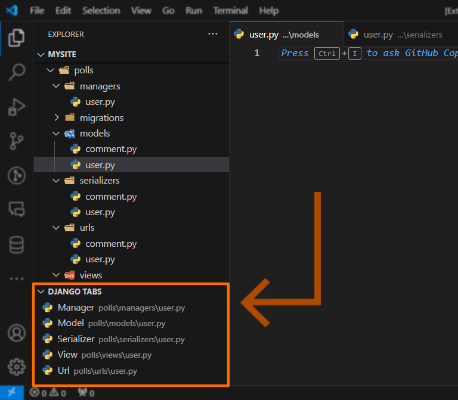

# Django Tabs

## Features

View in the Explorer container with *neighboring files of the active editor in the standard Django (REST) directory structure.

> *neighboring - files of the same name in their respective directory

### Example
In a complex project with multiple models, the directory structure ends up looking like this (focusing only on one fully established model `User`):

```
polls
├── managers
│   └── user.py
├── models
│   └── user.py
├── serializers
│   └── user.py
├── views
│   └── user.py
├── urls
│   └── user.py
...
```
With the User urls `user/urls/user.py` open in the active editor, the view would show the other four files: managers, models, serializers and views for the `user`.



## Settings
`config` - fully customize the labels and directories to show. (I recommend editing settings in JSON to change the order of items)
